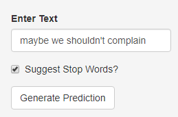
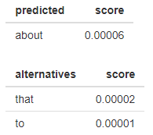

```{r setup, include=FALSE}
knitr::opts_chunk$set(echo = FALSE)
```

## Goal of our Application

We design an application in Shiny, which does the following:

 * Accepts textual user input in the form of an incomplete English sentence.
 
 * Returns a predicted English word, which should represent a sensible next word in the inputed text.
 
Our algorithm is based on a model trained on a corpus of text derived from the following sources:

  * News Articles
  * Tweets
  * Blog Posts
  
In the following slides, we will explain this model and how to use the application.

## N-Gram Models

In order to intelligently predict the next word of a sentence, we need some way to capture the context surrounding the suggested word. We do this by decomposing our text into N-grams.

An **N-gram** is a sequence of N words that appears in text. For example, "Happy Mother's Day" is a common trigram (3-gram) which appears in twitter data. 

Most N-gram models work by constructing a probability distribution based on the counts of various N-grams in the training data. Given such counts, we can approximate the following conditional probabilty for various words:

$$
\begin{equation}
\tag{A}
\textbf{Prob}(\text{word}_{n+1}|\text{word}_1,\text{word}_{2},\cdots,\text{word}_n)
\end{equation}
$$

We then choose $\text{word}_{n+1}$ that maximizes (A) over all N-grams.

## Stupid Backoff Model 

The so-called **stupid backoff** model simplifies the computation of conditional probabilities such as (A) by not requiring it to represent a true probability distribution. 

Instead, we compute a "score" denoted by $S(w|w_1,\cdots,w_n)$ or $S_n(w)$, which serves the same purpose:

$$
\begin{equation}
S_n(w) = 
\begin{cases}
\frac{\text{count}(w_1,\cdots,w_{n+1})}{\text{count}(w_1,\cdots,w_n)} & \text{ if } \text{count}(w_1,\cdots,w_{n+1}) > 0 \\ 
\lambda S_{n-1}(w) & \text{ otherwise.}
\end{cases}
\end{equation}
$$
where $\lambda > 0$ is a  weight term, and $S_{n-1}(w)$ indicates the score computed of the n-1 gram $(w_2,\cdots,w_n)$. For the base case $n=0$ we define $S_0(w) = \text{count}(w)/N$ where $N$ is the total number of words (1-grams/unigrams).

## How to Use the App
 
* Enter partial English sentence or phrase:
 
 <center>
 
 </center>
 
* Untick box to filter uninteresting "stop words"
 
  <center>
  
 </center>
*  Click "Generate Prediction" Button

## Final Remarks

For the best results, make sure you input a well-formed, error-free English phrase.

Our model uses data from news articles, twitter and blog posts. However, the model is very adaptable to other sources. One only needs to count the N-grams and calculate their scores. 

Assuming you have access to training data representative of the type of text you would like to  predict, our application can be easily "trained" on these new sources.

***References:***

 * [Speech and Language Processing. (3rd Draft)](https://web.stanford.edu/~jurafsky/slp3/) Daniel Jurafsky and James H. Martin. October 16, 2019. 
 * [Text Mining with R.](https://www.tidytextmining.com/index.html) Julia Silge and David Robinson. November 24, 2019.


