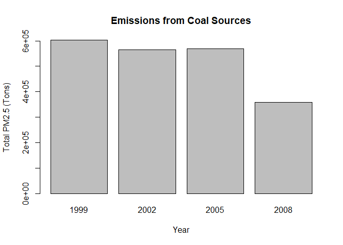

Exploratory Analysis: Course Project
================

## Preparing Data/Libraries

For this analysis, we are going to use dplyr to manipulate or data and
the base plotting system to make our exploratory plots.

``` r
NEI <- readRDS("exdata_data_NEI_data/summarySCC_PM25.rds")
SCC <- readRDS("exdata_data_NEI_data/Source_Classification_Code.rds")
```

## Have total emissions from PM2.5 decreased in the United States from 1999 to 2008?

To check this, we make a boxplot of total emissions for each of the
years 1999, 2002, 2005 and 2008. We look at the log of the values since
the order of magnitude varies greatly

``` r
years <- levels(as.factor(NEI$year))
totalpm25 <- sapply(years,function(x){
    temp <- subset(NEI, year == as.numeric(x) & Emissions > 0)
    sum(temp$Emissions)
}) 
barplot(totalpm25, names.arg = years, main = "Total PM2.5 per year in the US", ylab = "Total PM2.5 (Tons)", xlab = "Year" )
```

<!-- -->

It appears that the median values have dropped since 1999, however from
2002-2008 there is not a noticeable drop.

## Have total emissions from PM2.5 decreased in the Baltimore City, Maryland (fips == “24510”) from 1999 to 2008?

``` r
years <- levels(as.factor(NEI$year))
baltpm25 <- sapply(years,function(x){
    temp <- subset(NEI, year == as.numeric(x) & Emissions > 0 & fips == "24510")
    sum(temp$Emissions)
}) 
barplot(baltpm25, names.arg = years, main = "Total PM2.5 per year in Baltimore", ylab = "Total PM2.5 (Tons)", xlab = "Year" )
```

<!-- -->

We can see from the boxplots that the bulk of the emissions readings
have lowered over the years.

## Of the four types of sources indicated by the type (point, nonpoint, onroad, nonroad) variable, which of these four sources have seen decreases in emissions from 1999-2008 for Baltimore City? Which have seen increases in emissions from 1999-2008?

``` r
library(ggplot2)
years <- levels(as.factor(NEI$year))
baltdata <- subset(NEI, fips == "24510" & Emissions >= 0)
type <- levels(as.factor(baltdata$type))
balttype <- data.frame(year = rep(as.numeric(years), each = 4), type = rep(type, times = 4))
total <- sapply(1:16, function(x){
    y <- as.numeric(balttype[x,1])
    t <- balttype[x,2]
    temp <- subset(baltdata, year == y & type == t)
    sum(temp$Emissions)
})
balttype$pm25 = total
ggplot(balttype, aes(x=factor(year), y= pm25)) + geom_bar(stat="identity") + facet_grid( type ~ ., scales = "free_y") + labs(x = "Year", y = "Total PM2.5")
```

<!-- -->

It appears that each type has seen a drop in it’s median over the years,
with the point type being the most drastic, the other types the decrease
is more subtle.

## Across the United States, how have emissions from coal combustion-related sources changed from 1999-2008?

We use grep on the Short.Name variable to determine which SCC codes
refer to coal combustion sources, then subset our NEI data using these
codes. We look at only the data where the log lies between 0 and 2,
which contains the bulk of the measurements

``` r
years <- levels(as.factor(NEI$year))
coalsources <- SCC$SCC[grepl("[Cc]oal",as.character(SCC$Short.Name))]
sources <- as.character(coalsources)
coaldata <- subset(NEI, SCC %in% sources)
coalpm25 <- sapply(years,function(x){
    temp <- subset(coaldata, year == as.numeric(x) & Emissions > 0)
    sum(temp$Emissions)
}) 
barplot(coalpm25, names.arg = years, main = "Emissions from Coal Sources", ylab = "Total PM2.5 (Tons)", xlab = "Year")
```

<!-- -->

## How have emissions from motor vehicle sources changed from 1999-2008 in Baltimore City?

``` r
years <- levels(as.factor(NEI$year))
vehiclesources <- SCC$SCC[grepl("[Vv]ehicle",as.character(SCC$Short.Name))]
sources <- as.character(vehiclesources)
baltvehicle <- subset(baltdata, SCC %in% sources)
baltcar <- sapply(years,function(x){
    temp <- subset(baltvehicle, year == as.numeric(x) & Emissions > 0)
    sum(temp$Emissions)
}) 
barplot(baltcar, names.arg = years, xlab = "Year", ylab = "PM2.5 (Tons)", main = "Emissions from Vehicle Sources")
```

<!-- -->

## Compare emissions from motor vehicle sources in Baltimore City with emissions from motor vehicle sources in Los Angeles County, California (fips == “06037”). Which city has seen greater changes over time in motor vehicle emissions?

``` r
years <- levels(as.factor(NEI$year))
city <- c("Baltimore","Los Angeles")
sources <- as.character(SCC$SCC[grepl("Vehicle",as.character(SCC$Short.Name))])
vehicledata <- subset(NEI, SCC %in% sources & fips %in% c("24510","06037"))
twocity <- data.frame(year = rep(as.numeric(years), times = 2), city = rep(city, each = 4))
citypm2 <- sapply(1:8, function(x){
    y <- as.numeric(twocity[x,1])
    f <- if(twocity[x,2] == "Baltimore"){
        as.factor("24510")}else {as.factor("06037")}
    temp <- subset(vehicledata, year == y & fips == f)
    sum(temp$Emissions)
})
twocity$pm25 = citypm2
ggplot(twocity, aes(x=factor(year), y= pm25)) + geom_bar(stat="identity") + facet_grid( city ~ ., scales ="free_y") + labs(x = "Year", y = "Total PM2.5")
```

<!-- -->

``` r
twocity
```

    ##   year        city       pm25
    ## 1 1999   Baltimore   72.52000
    ## 2 2002   Baltimore   38.72593
    ## 3 2005   Baltimore   34.73461
    ## 4 2008   Baltimore   24.62275
    ## 5 1999 Los Angeles 1474.39600
    ## 6 2002 Los Angeles 1202.22717
    ## 7 2005 Los Angeles 1206.40674
    ## 8 2008 Los Angeles  952.30448
