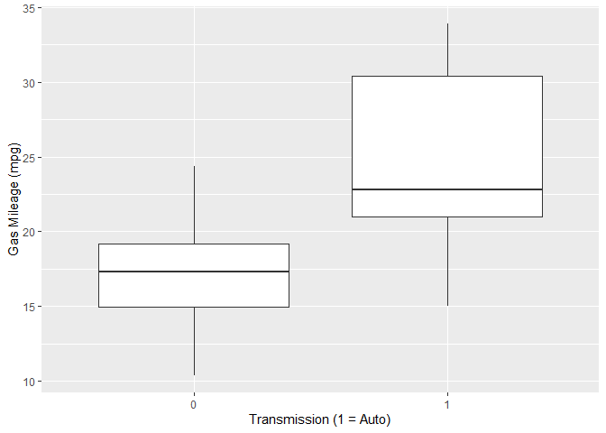
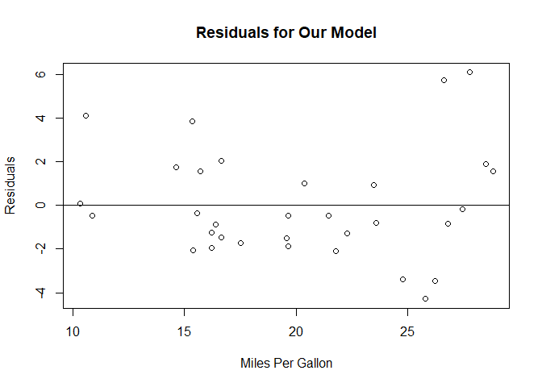

Project: Exploring the Effects of Transmission Type on Gas Mileage.
================

In this document, we examine a dataset extracted from the 1974 Motor
Trend magazine which contains data on 32 different automobiles from the
1973-74 era. We were primarily interested in studying the effects of
transmission type on gas mileage. We noticed that as a group, automatic
vehicles tend to have better gas mileage than manual transmissions cars,
the average automatic car gets about 7 miles per gallon more than the
average manual transmission car. However, manual cars also tend to weigh
more, have more cylinders, and output more horsepower among other
differences. When we adjusted for these differences, the transmission
type does not seem to make a significant difference on the gas mileage.
This suggests that if you wish to pick a car with better gas mileage you
may do better to pick a lightweight car with fewer cylinders, instead of
focusing on the transmission type. We detail these findings in
subsequent sections.

## A First Look at the Data

We start by looking at a few lines from the dataset to familiarize
ourselves the variables we will be working with:

``` r
tail(mtcars,3)
```

    ##                mpg cyl disp  hp drat   wt qsec vs am gear carb
    ## Ferrari Dino  19.7   6  145 175 3.62 2.77 15.5  0  1    5    6
    ## Maserati Bora 15.0   8  301 335 3.54 3.57 14.6  0  1    5    8
    ## Volvo 142E    21.4   4  121 109 4.11 2.78 18.6  1  1    4    2

The variables of primary interest are ‘mpg’ which encodes the gas
mileage (miles per gallon) and ‘am’ which is a binary variable with ‘1’
indicating that model is automatic and ‘0’ indicating manual
transmission. To get a better idea of the differences in automatic and
manual cars, we look at the averages of the other variables for the cars
with both types:

    ##     type num   mpg  cyl   disp     hp drat   wt  qsec   vs gear carb
    ## 1   auto  13 24.39 5.08 143.53 126.85 4.05 2.41 17.36 0.54 4.38 2.92
    ## 2 manual  19 17.15 6.95 290.38 160.26 3.29 3.77 18.18 0.37 3.21 2.74

We see that automatic cars get around 7 miles per gallon more than the
manual transmission cars on average. However, we cannot be too quick to
assume that this is due solely to the style of transmission since there
may be a confounding variable. We also note that *on average* manual
transmission cars have 2 more cylinders, output higher horsepower
(\~35), have one fewer gear, and weigh over a ton more. We take a closer
look at the gas mileage for each group:

``` r
qplot(factor(am), mpg, data=mtcars, geom="boxplot", 
      xlab = "Transmission (1 = Auto)", ylab = "Gas Mileage (mpg)")
```



We see the 25th percentile of the automatic transmission cars is above
the 75th percentile of manual transmissions. In the next two sections
we’ll work on separating out the effects of these other variables to
see which ones are significant predictors of gas mileageo

## Checking for Relevant Predictors

Our goal is to examine which features of an automobile contribute to gas
mileage. The variables in the mtcars dataset can be thought of as either
performance metrics or physical characteristics of the car/engine. We
will focus on the variables which differ the most between the automatic
and manual transmissions cars: cylinders, displacement, horsepower,
weight and gears.

``` r
full.fit <- lm(mpg~cyl+disp+wt+hp+gear+factor(am), data = mtcars)
```

The first basic check we do is to fit mpg as a linear function of these
predictors of interest, then check the F-statistic as well as the
individual p-values for the coefficients:

``` r
round(summary(full.fit)$fstatistic,3)
```

    ##  value  numdf  dendf 
    ## 24.608  6.000 25.000

The F-statistic is about 24.6 with a small p-value (\~\(10^{-9}\)),
which indicates at least one of the predictors is non-trivially related
to the gas mileage. Next, we look at the coefficients of the linear
model and their p-values:

``` r
round(summary(full.fit)$coefficients,3)
```

    ##             Estimate Std. Error t value Pr(>|t|)
    ## (Intercept)   37.742      6.023   6.266    0.000
    ## cyl           -1.086      0.719  -1.510    0.144
    ## disp           0.013      0.012   1.011    0.322
    ## wt            -3.310      1.159  -2.857    0.008
    ## hp            -0.029      0.017  -1.722    0.097
    ## gear           0.120      1.234   0.098    0.923
    ## factor(am)1    1.465      1.743   0.841    0.408

We also notice that the weight variable has a small p-value (.008),
indicating a strong correlation with mpg. The other variables all have
relatively high (0.09 or above) p-values, so we are less confident that
they significantly contribute to differences in gas mileage. In general,
this model is pretty poor for our purposes, so we will use a strategy to
prune the less significant predictors.

## Model Selection

To determine the models, we use a model selection strategy called
*backwards selection* as described in (James et al. 2017). In backwards
selection, we repeatedly remove the predictor with the highest p-value
(thus, the least statistical significance). Stopping once all the
remaining predictors have p-value less than some threshold. In this
case, we choose \(p < 0.5\).

We start with the model given by ‘full.fit’ which included cyl, disp,
wt, hp, gear and am:

``` r
fit <- full.fit
```

we determine the predictor with the highest p-value:

``` r
coeff <- summary(fit)$coefficients
ind <- which.max(coeff[,4])
pvalue <- coeff[ind,4]
c(row.names(coeff)[ind],pvalue)
```

    ## [1] "gear"              "0.923034826449845"

Then remove that predictor and update the model:

``` r
fit <- update(fit, ~.-gear)
```

continuing in this fashion, until the remaining predictors have small
p-values:

    ## [1] "disp"              "0.304719404207662"

    ## [1] "factor(am)1"       "0.314179886317532"

    ## [1] "hp"                "0.140015155016129"

    ## [1] "cyl"                 "0.00106428178479494"

Since ‘cyl’ has a sufficiently small p-value, we leave it in the model
and terminate the selection process:

    ##             Estimate Std. Error t value Pr(>|t|)
    ## (Intercept)   39.686      1.715  23.141    0.000
    ## cyl           -1.508      0.415  -3.636    0.001
    ## wt            -3.191      0.757  -4.216    0.000

Our model selection algorithm pruned gear, disp, am, and hp before all
the remaining variables reach a sufficient p-value. Leaving us with a
model containing only the number of cylinders and weight as predictors.

We build several nested models based on this strategy, adding the
predictors which had the lower p-values first. We include ‘am’ in the
final nested model for demonstration purposes, even though our selection
strategy forced us to reject it:

``` r
fit <- lm(mpg~wt,data=mtcars)
fit2 <- update(fit,~.+cyl)
fit3 <- update(fit2,~.+factor(am))
```

## Comparing Nested Models

To compare our nested models we use the anova function, which performs a
hypothesis test to see if a model fits the data better than the previous
model:

``` r
anova(fit,fit2,fit3)
```

    ## Analysis of Variance Table
    ## 
    ## Model 1: mpg ~ wt
    ## Model 2: mpg ~ wt + cyl
    ## Model 3: mpg ~ wt + cyl + factor(am)
    ##   Res.Df    RSS Df Sum of Sq       F Pr(>F)   
    ## 1     30 278.32                               
    ## 2     29 191.17  1    87.150 12.7728 0.0013 **
    ## 3     28 191.05  1     0.125  0.0183 0.8933   
    ## ---
    ## Signif. codes:  0 '***' 0.001 '**' 0.01 '*' 0.05 '.' 0.1 ' ' 1

As we suspected, the model with both weight and number of cylinders
represents a significant improvement over the model with just weight.
However, including transmission type ‘am’ does not result in an improved
model. We suspect then that weight and number of cylinders are
significant predictors of gas mileage while transmission type is not.

## Interpreting the Model

We settle on the model given by fit2, where the response mpg depends
only on the predictors wt and cyl.

``` r
summary(fit2)
```

    ## 
    ## Call:
    ## lm(formula = mpg ~ wt + cyl, data = mtcars)
    ## 
    ## Residuals:
    ##     Min      1Q  Median      3Q     Max 
    ## -4.2893 -1.5512 -0.4684  1.5743  6.1004 
    ## 
    ## Coefficients:
    ##             Estimate Std. Error t value Pr(>|t|)    
    ## (Intercept)  39.6863     1.7150  23.141  < 2e-16 ***
    ## wt           -3.1910     0.7569  -4.216 0.000222 ***
    ## cyl          -1.5078     0.4147  -3.636 0.001064 ** 
    ## ---
    ## Signif. codes:  0 '***' 0.001 '**' 0.01 '*' 0.05 '.' 0.1 ' ' 1
    ## 
    ## Residual standard error: 2.568 on 29 degrees of freedom
    ## Multiple R-squared:  0.8302, Adjusted R-squared:  0.8185 
    ## F-statistic: 70.91 on 2 and 29 DF,  p-value: 6.809e-12

For a hypothetical car with 0 weight and 0 cylinders, our model predicts
a baseline gas mileage of around 40 mpg. Each additional 1000 lbs
results in roughly 3 miles *less* per gallon, and each additional pair
of cylinders also costs roughly 3 miles per gallon (1.5 per cylinder).
We see that our residuals vary between \((-4.3,6.1)\) with around half
of the true values within 2 miles per gallon of the predicted value. The
residual standard error (RSE) is about 2.5 and the R-squared statistic
is 0.83, meaning this model accounts for roughly 83% of the observed
variance in miles per gallon over the sample cars. Next, we take a look
at the plot of the residuals:

``` r
plot(predict(fit2),residuals(fit2), main="Residuals for Our Model", 
     xlab = "Miles Per Gallon", ylab = "Residuals")
abline(h=0)
```



It seems like our model may underestimate the true value for both lower
and higher mpg values. This may be due to a non-linearity in the true
model. For example, it may be the case that distance traveled per gallon
depends on the square of the weight. This could be worth exploring in a
later analysis.

### References

<div id="refs" class="references">

<div id="ref-ISLR">

James, Gareth, Daniela Witten, Trevor Hastie, and Robert Tibshirani.
2017. *An Introduction to Statistical Learning with Applications in R*.
Springer.

</div>

</div>
