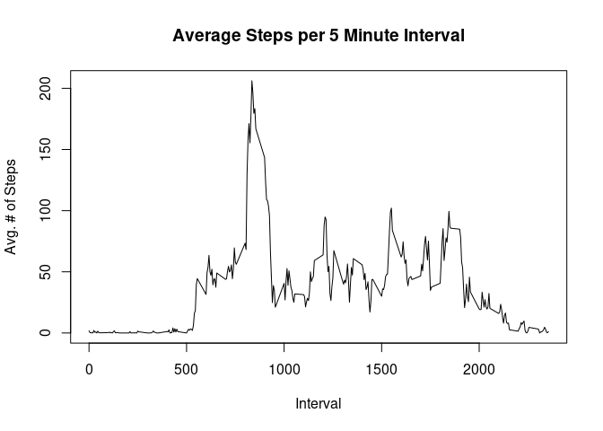
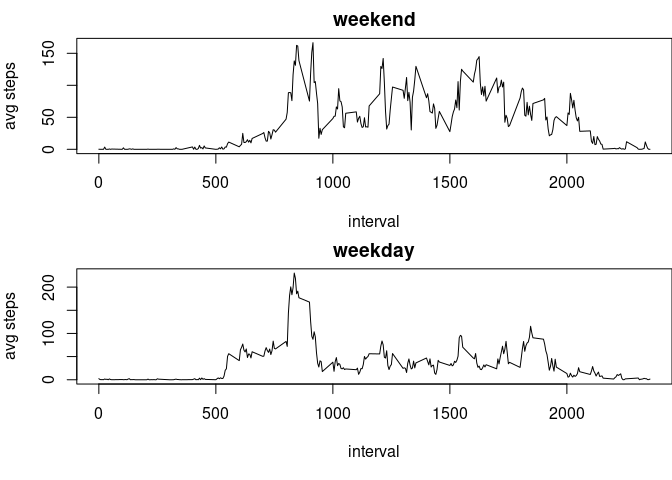

## Loading and preprocessing the data

We're going to primarily use the dplyr package for our analysis.


```r
library(dplyr)
```

```
## 
## Attaching package: 'dplyr'
```

```
## The following objects are masked from 'package:stats':
## 
##     filter, lag
```

```
## The following objects are masked from 'package:base':
## 
##     intersect, setdiff, setequal, union
```

```r
setwd("~/Documents/git/RepData_PeerAssessment1")
activity <- tbl_df(read.csv("activity.csv"))
```


## What is mean total number of steps taken per day?

We group the data by date and compute at the total number of steps per day:


```r
by_date <- activity %>%
    group_by(date) %>%
    summarize(total_steps = sum(steps, na.rm = TRUE))
```

From this we can compute the mean number of steps per day:


```r
mean(by_date$total_steps)
```

```
## [1] 9354.23
```

Similarly, we can compute the median number of steps per day:


```r
median(by_date$total_steps)
```

```
## [1] 10395
```

## What is the average daily activity pattern?

To examine the average daily activity patterns, we start by grouping the data by interval and average the number of steps taken over each day:


```r
by_interval <- activity %>%
    group_by(interval) %>%
    summarize(average_steps = mean(steps, na.rm = TRUE))
```

We can then plot a time-series of this mean over the interval, to see the average activity per interval:


```r
plot(by_interval$interval, by_interval$average_steps, type ="l", main = "Average Steps per 5 Minute Interval", xlab="Interval", ylab="Avg. # of Steps")
```

<!-- -->

We can determine the interval with the largest average number of steps, by sorting by average_steps:


```r
tail(arrange(by_interval, average_steps))
```

```
## # A tibble: 6 x 2
##   interval average_steps
##      <int>         <dbl>
## 1      820          171.
## 2      830          177.
## 3      845          180.
## 4      850          183.
## 5      840          196.
## 6      835          206.
```

We see that the interval 835 has the largest average number of steps, and the 5 most active intervals are all roughly consecutive.


## Imputing missing values

Our data has a considerable number of missing values, we can see this by creating a logical column indicated the rows which contain NA values. We also create a column containing the average steps per interval over all days, which we borrow from the 'by_interval' data frame we created earlier:


```r
names(activity)
```

```
## [1] "steps"    "date"     "interval"
```

```r
activity <- mutate(activity, contains_na = is.na(steps) | is.na(date) | is.na(interval))
sum(activity$contains_na)
```

```
## [1] 2304
```

All the NA values correspond to intervals for which we are missing step data. We fill in these missing values by replacing NA with the corresponding value from avgsteps:


```r
head(by_interval)
```

```
## # A tibble: 6 x 2
##   interval average_steps
##      <int>         <dbl>
## 1        0        1.72  
## 2        5        0.340 
## 3       10        0.132 
## 4       15        0.151 
## 5       20        0.0755
## 6       25        2.09
```

```r
new_data <- mutate(activity, steps = as.double(steps))
new_data$avg_steps <- by_interval$average_steps
new_data <- mutate(new_data, steps = if_else(is.na(steps),avg_steps,steps))
```


We save this as a new data set:


```r
imputed_data <- select(new_data,steps,date,interval)
imputed_date <- imputed_data %>%
    group_by(date) %>%
    summarize(total_steps = sum(as.integer(steps), na.rm = TRUE))
head(imputed_date)
```

```
## # A tibble: 6 x 2
##   date       total_steps
##   <fct>            <int>
## 1 2012-10-01       10641
## 2 2012-10-02         126
## 3 2012-10-03       11352
## 4 2012-10-04       12116
## 5 2012-10-05       13294
## 6 2012-10-06       15420
```

Using this new data, we can create a histogram of the total steps per day:


```r
hist(imputed_date$total_steps, breaks = 10,main = "Histogram of Total Steps per Day", xlab="Total Steps (Day)")
```

<!-- -->

The mean of the total steps per day is as follows:


```r
mean(imputed_date$total_steps)
```

```
## [1] 10749.77
```

Similarly, the median of the total steps per day is given by:


```r
median(imputed_date$total_steps)
```

```
## [1] 10641
```

## Are there differences in activity patterns between weekdays and weekends?

Next, we add a new column to our new dataset, indicating whether the date corresponds to a weekend or weekday:


```r
imputed_data <- mutate(imputed_data, date = as.POSIXct(strptime(date ,"%Y-%m-%d")))
imputed_data <- mutate(imputed_data, day_type = if_else(weekdays(date) ==  "Saturday" | weekdays(date) == "Sunday","weekend","weekday"))
```

We use this new column to compare activity on weekends to weekdays. First, we separate our data based on this new factor variable:


```r
weekend <- imputed_data %>%
  filter(day_type == "weekend") %>%
    group_by(interval) %>%
    summarize(average_steps = mean(steps, na.rm = TRUE))

weekday <- imputed_data %>%
  filter(day_type == "weekday") %>%
    group_by(interval) %>%
    summarize(average_steps = mean(steps, na.rm = TRUE))
```

We then create two line plots comparing the average steps per interval:


```r
par(mfrow = c(2,1),mar=c(4,4,2,0),oma=c(1,0,0,0))
plot(weekend$interval, weekend$average_steps, xlab = "interval", ylab = "avg steps", type = "l", main = "weekend")
plot(weekday$interval, weekday$average_steps, xlab = "interval", ylab = "avg steps", type = "l", main = "weekday")
```

<!-- -->

From these plots it appears that our user is consistently more active throughout the day on weekends.
