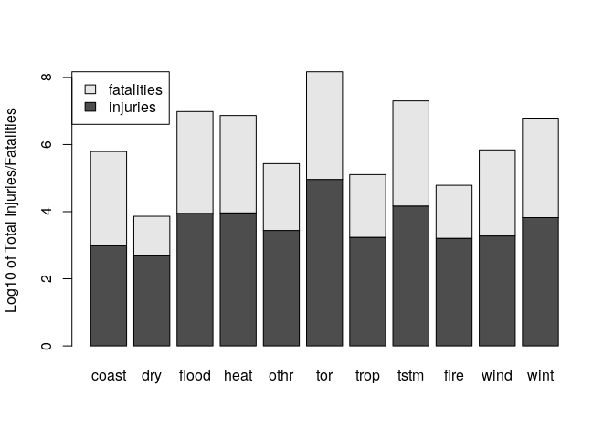
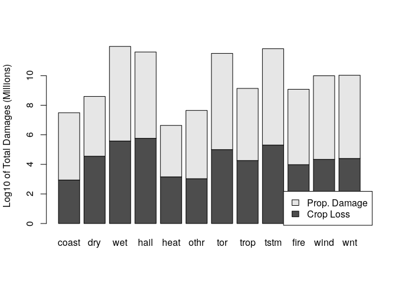

## Synopsis

In this document, we look at the effects of severe weather events in the United States, in regards to both public health and economic damage. For this analysis we use the data from the NOAA Storm Database, which includes records from 1950 through November 2011. We group similar weather events together (e.g. flood events, tropical storms) and look at the total number of injuries/fatalities as well as the total crop loss and property damages to ascertain which events have the most effect.


## Data Processing

We begin by downloading our data to our working directory and reading in our .csv file. We include the output of the str() function to get a first look at the data


```r
filename <- "repdata_data_StormData.csv.bz2"
if(!file.exists(filename)){
    dataurl <- "https://d396qusza40orc.cloudfront.net/repdata%2Fdata%2FStormData.csv.bz2"
    download.file(dataurl,destfile=filename)
}
NOAA <- read.csv(filename) 
```

We want to evaluate the health impacts of our data, so we will subset our data to only include events that resulted in nonzero fatalities or injuries.


```r
fatalevents <- subset(NOAA, FATALITIES >= 1)
injuryevents <- subset(NOAA, INJURIES >= 1)
```

Next, we want to group similar events together since the ENVTYPE factor variable has over 900 levels. We begin by storing all the various event types in a vector. We remove some the nondescript events which are summaries of days/months and dont lend themselves to easily to categorization. 


```r
eventnames <- levels(NOAA$EVTYPE)
regex <- "SUMMARY|Summary|MONTHLY|Monthly"
eventnames <- eventnames[!grepl(regex, eventnames)]
length(eventnames)
```

```
## [1] 912
```

We want to group similar event together (e.g. Snow, Blizzard, Ice are all "winter" events). To achieve this we use regular expressions to extract the relevant event names, which we will later use to subset and summarize the data. We start with all events corresponding to wild fires:


```r
regex <- "FIRE|Fire|fire|Smoke|SMOKE"
wildfire <- grep(regex, eventnames, value = TRUE)
eventnames <- eventnames[!grepl(regex, eventnames)]
```

For our tornado group, we consder all events involving "funnels", "spouts" and "whirl winds":


```r
regex <- "TORNADO|[Tt]ornado|FUNNEL|[Ff]unnel|SPOUT|[Ss]pout|DEVIL|[Dd]evil|[Ww]hirl|WHIRL|TORNDAO"
tornado <- grep(regex, eventnames, value = TRUE)
eventnames <- eventnames[!grepl(regex, eventnames)]
```

We use several phrases to match winter events, all of which involve cold temperatures and/or freezing precipitation:

```r
regex <- "M[Ii][Xx]|WINT|[Ww]int|SNOW|[Ss]now|SLEET|I[Cc][Ee]|[Cc]old|COLD|BLIZZARD|[Bb]lizzard|FREEZ|[Ff]reez|[Ff]rost|FROST|AVALAN|[Hh][Yy][Pp][Oo]|EXPOSURE"
winter <- grep(regex, eventnames, value = TRUE)
eventnames <- eventnames[!grepl(regex, eventnames)]
```

Next, we want to include all hurricanes, tropical storm and typhoon events: 


```r
regex <- "[Hh]urricane|HURRICANE|[Tt]ropical|TROPICAL|DEPRESSION|TYPHOON|[Tt]yphoon"
tropical <- grep(regex, eventnames, value = TRUE)
eventnames <- eventnames[!grepl(regex, eventnames)]
```

For thunder storms, we match "thunder", "lightning" and the commonly used abbreviation "tstm":

```r
regex <- "THUNDER|[Tt]hunder|LIGHTNING|[Ll]ightning|TSTM|[Tt]stm"
tstorm <- grep(regex, eventnames, value = TRUE)
eventnames <- eventnames[!grepl(regex, eventnames)]
```

Next, we want to capture all the flooding events that aren't already included in the thunder storm or tropical storm categories:

```r
regex <- "WET|[Ww]et|[Ff]lood|FLOOD|[Uu]rban|URBAN|[Ss]tream|STREAM|[Rr]ain|RAIN|PREC|[Pp]rec"
flood <- grep(regex, eventnames, value = TRUE)
eventnames <- eventnames[!grepl(regex, eventnames)]
```

Next, we want all the wind related weather events which aren't already part of one of the previously generated groups:


```r
regex <- "WIND|[Ww]ind|[Gg]ust|GUST"
wind <- grep(regex, eventnames, value = TRUE)
eventnames <- eventnames[!grepl(regex, eventnames)]
```

For drought related events we match "dry", "drought" and "dust":


```r
regex <- "Drought|DROUGHT|Dry|DRY|DUST|Dus|dry"
dry <- grep(regex, eventnames, value = TRUE)
eventnames <- eventnames[!grepl(regex, eventnames)]
```

For the group of extreme heat events, we match "high temp", "warm", and "heat":


```r
regex <- "WARM|[Ww]arm|[Hh]eat|HEAT|[Hh]OT|HIGH TEMP|[Hh]igh [Tt]emp"
heat <- grep(regex, eventnames, value = TRUE)
eventnames <- eventnames[!grepl(regex, eventnames)]
```

Finally, we want to capture of the coastal and oceanic related weather events, including currents, tides, waves, and surges:


```r
regex <- "TIDE|[Tt]ide|SURGE|[Ss]urge|[Cc]urrent|CURRENT|TSUNAMI|[Tt]sunami|WAVE|[Ww]ave|SURF|[Ss]urf|[Ss]ea|SEA|BEACH|[Bb]each|SWELL|[Ss]well|[Mm]arine|MARINE"
coastal <- grep(regex, eventnames, value = TRUE)
```

The remaining events are stored in the "other" group, these include events such as hail storms and volcanic events. We see that around 100 event types fall into the other group. Hence, 800 of the 900 different event types fall into one of our groups. 


```r
other <- eventnames[!grepl(regex, eventnames)]
length(other)
```

```
## [1] 107
```

We use these groups to form a data frame containing total injuries/fatalites corresponding to each group, as well as total count of events corresponding to at least one fatality/injury. We extract out the subsets of our data corresponding to those event types which fall into the above groups, and sum up the total number of injuries/fatalities. We put these values into a data.frame, along with a variable indicating the total number of individual events involving a death or fatality.


```r
eventnames = c("coastal","dry","flood","heat","other","tornado","tropical","tstorm","wildfire","wind","winter")
eventlist = list(coastal, dry, flood, heat, other, tornado, tropical, tstorm, wildfire, wind, winter)
injury <- sapply(eventlist, function(x){
    temp <- subset(injuryevents, EVTYPE %in% x)
    sum(temp$INJURIES)
})
injtotal <-sapply(eventlist, function(x){
    sum(injuryevents$EVTYPE %in% x)
})
fatal <- sapply(eventlist, function(x){
    temp <- subset(fatalevents, EVTYPE %in% x)
    sum(temp$FATALITIES)
})
deathtotal <-sapply(eventlist, function(x){
    sum(fatalevents$EVTYPE %in% x)
})
healtheffects <- data.frame(names = eventnames, injuries = injury, inj.events = injtotal, avg.inj = injury/injtotal,  fatal = fatal, 
                            fat.events = deathtotal, avg.fat = fatal/deathtotal)
```

To determine economic damage, we consider the damage totals for both the crops and property. We subset our data to include only the events where nonzero crop loss or property damage occured.


```r
croploss <- subset(NOAA, CROPDMG > 0)
propdamage <- subset(NOAA, PROPDMG > 0)
```

Next, we sum the total losses for events falling into the groups which we determined previously. We also include a count of the total number of events which result in damages for each event group. We form a data frame from these totals, which we will use for our analysis. We add one more event type group, for our damages analysis, containing the hail events:


```r
regex <- "[Hh]ail|HAIL"
hail <- grep(regex, other, value = TRUE)
other <- other[!grepl(regex, other)]
eventnames = c("coastal","dry","flood","hail", "heat", "other","tornado","tropical","tstorm","wildfire","wind","winter")
eventlist = list(coastal, dry, flood, hail, heat, other, tornado, tropical, tstorm, wildfire, wind, winter)
```

We use the groups to summary the economic damage data, we use the PROPDMGEXP and CROPDMGEXP columns to scale the values by their respective orders of magnitude: H - hundred, K - thousand, M - million, B - billion


```r
croptotal <- sapply(eventlist, function(x){
    temp <- subset(croploss, EVTYPE %in% x)
    temp$CROPTOTAL = 0
    temp$CROPTOTAL[temp$CROPDMGEXP == "H"] = temp$CROPDMG[temp$CROPDMGEXP == "H"] * 10^2
    temp$CROPTOTAL[temp$CROPDMGEXP == "K"] = temp$CROPDMG[temp$CROPDMGEXP == "K"] * 10^3
    temp$CROPTOTAL[temp$CROPDMGEXP == "M"] = temp$CROPDMG[temp$CROPDMGEXP == "M"] * 10^6
    temp$CROPTOTAL[temp$CROPDMGEXP == "B"] = temp$CROPDMG[temp$CROPDMGEXP == "B"] * 10^9
    sum(temp$CROPTOTAL)
})
cropevent <-sapply(eventlist, function(x){
    sum(croploss$EVTYPE %in% x)
})
proptotal  <- sapply(eventlist, function(x){
    temp <- subset(propdamage, EVTYPE %in% x)
    temp$PROPTOTAL = 0
    temp$PROPTOTAL[temp$PROPDMGEXP == "H"] = temp$PROPDMG[temp$PROPDMGEXP == "H"] * 10^2
    temp$PROPTOTAL[temp$PROPDMGEXP == "K"] = temp$PROPDMG[temp$PROPDMGEXP == "K"] * 10^3
    temp$PROPTOTAL[temp$PROPDMGEXP == "M"] = temp$PROPDMG[temp$PROPDMGEXP == "M"] * 10^6
    temp$PROPTOTAL[temp$PROPDMGEXP == "B"] = temp$PROPDMG[temp$PROPDMGEXP == "B"] * 10^9
    sum(temp$PROPTOTAL)
})
propevents <-sapply(eventlist, function(x){
    sum(propdamage$EVTYPE %in% x)
})
economicloss <- data.frame(Names = eventnames, crop.loss = croptotal, crp.evnts = cropevent, avg.crp = croptotal/cropevent, prop.dmg = proptotal, prp.evnts = propevents, avg.prp = proptotal/propevents)
```

## Results

### Injuries and Fatalities by Event Type

Since the total fatalities/injuries vary by orders of magnitude, we take the log of the total injury/fatality counts:


```r
barplot(t(cbind(log10(injury),log10(deathtotal))), names.arg = c("coast", "dry", "flood", "heat", "othr", "tor", "trop", "tstm", "fire", "wind", "wint"), legend.text = c("injuries","fatalities"), ylab = "Log of Total Injuries/Fatalities", main = "Injuries and Fatalities per Event Type",args.legend = list(x = "topleft"))
```

<!-- -->


We can see that the largest number of reported injuries and fatalities are due to tornado related weather events. Flooding, winter events, heat-related events, and thunderstorms also have relatively large fatality/injury counts. Also, our the "other" group accounts for a relatively small portion of the remaining deaths/injuries. We can also look at the data frame directly:


```r
healtheffects
```

```
##       names injuries inj.events   avg.inj fatal fat.events  avg.fat
## 1   coastal      969        301  3.219269   818        638 1.282132
## 2       dry      487         57  8.543860    60         15 4.000000
## 3     flood     8961        663 13.515837  1654       1072 1.542910
## 4      heat     9228        232 39.775862  3143        795 3.953459
## 5     other     2756        441  6.249433   167         98 1.704082
## 6   tornado    91482       7728 11.837733  5667       1609 3.522063
## 7  tropical     1716         58 29.586207   201         74 2.716216
## 8    tstorm    14775       6468  2.284323  1547       1349 1.146775
## 9  wildfire     1608        316  5.088608    90         38 2.368421
## 10     wind     1896        699  2.712446   466        365 1.276712
## 11   winter     6650        641 10.374415  1332        921 1.446254
```

By inspecting the numbers directly we see that tornado events are clearly ahead of the other groups in terms of injury/death counts and also in terms of total number of events. Thunder storm events also account for a large number of deaths/injurys and total events. We see that tropical storms, tornadoes and heat events all have high average injury/death totals per event.

### Economic Losses by Event Type

Since the total damages can vary by orders of magnitude across the event groups, we use a barplot with a logarithmic scale similar to one we made for fatalities and injuries to view the total damages:


```r
barplot(t(cbind(log10(croptotal),log10(proptotal))), names.arg = c("coast", "dry", "wet", "hail", "heat", "othr", "tor", "trop", "tstm", "fire", "wind", "wnt"), legend.text = c("Crop Loss", "Prop. Damage"), ylab = "Log of Total Damages ($)", main = "Crop Loss/Prop. Dmg Totals per Event Type", args.legend = list(x = "bottomright"))
```

<!-- -->

From this we can see that the hail, flooding, tornadoes, thunder storms corresponding to largest groups in terms of total damages. We also inspect the data frame directly.


```r
economicloss
```

```
##       Names   crop.loss crp.evnts    avg.crp     prop.dmg prp.evnts
## 1   coastal      875000         4   218750.0  48220858500       358
## 2       dry 13975736780       271 51570984.4   1058607600       199
## 3     flood 13336700000      4395  3034516.5 170808650710     33234
## 4      hail  3046420450      9389   324467.0  15969139220     23062
## 5      heat   904423500        19 47601236.8     20125750        43
## 6     other    21051400        32   657856.2    355577800       393
## 7   tornado   417461360      1502   277937.0  58592100160     39217
## 8  tropical  6201013800       163 38043029.4  93052537560       654
## 9    tstorm  1283796990      5556   231065.0  11907945310    126700
## 10 wildfire   403281630       130  3102166.4   8501728500      1057
## 11     wind   767867100       333  2305907.2   6074160040      9391
## 12   winter  8735127900       305 28639763.6  12718313450      4866
##         avg.prp
## 1  134695135.47
## 2    5319636.18
## 3    5139575.46
## 4     692443.81
## 5     468040.70
## 6     904778.12
## 7    1494048.50
## 8  142282167.52
## 9      93985.36
## 10   8043262.54
## 11    646806.52
## 12   2613710.12
```

We see that droughts and floods account for the largest total crop loss, while flooding, tropical storms and winter events account for the most property damage. Our hail group is notable for the number of events and total damages, in the previous analysis we considered hail events among the "other" group which accounts for a relatively small portion of the remaining totals. Tornados account for a relatively large portion of property damage, while a relatively small portion of crop loss. Heat events, although relatively rare, have high average losses per event. Tropical storms and coastal weather events both cause significant damage per event.

### Closing Remarks

From this simple analysis, we see that flooding, tornadoes and thunder storms account for large numbers of deaths and injuries as well as economic damage. Extreme heat events are particularly dangerous to public health and cause significant crop loss per event. Hail events do not seem pose much of a threat to public health even if grouped in with other miscellaneous events, however there are many instances of hail events which cause crop loss and property damage. Tropical storm and coastal events both cause significant damages even though they are relatively infrequent.
