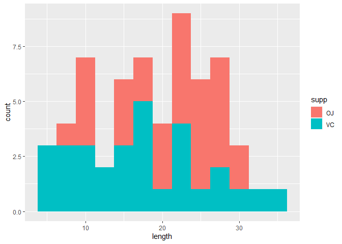
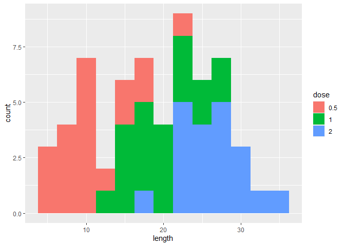

Exploring the ToothGrowth Dataset
================

In this document, we want to perform a basic exploratory data analysis
on the ToothGrowth dataset. According to the documentation, this dataset
looks at the length of the odontoblasts (cells responsible for tooth
growth) in 60 guinea pigs which were given varying doses (0.5, 1, and 2
mg/day) of Vitamin C via two different delivery methods (OJ or VC).
Before we try any analyses on the data, we take a quick look at the
summary of the dataset. For convenience, we convert the dosage into a
factor variable with 3 levels:

``` r
library(ggplot2)
data("ToothGrowth")
data <- data.frame(len = ToothGrowth$len, 
                   supp = ToothGrowth$supp, dose = as.factor(ToothGrowth$dose))
summary(data)
```

    ##       len        supp     dose   
    ##  Min.   : 4.20   OJ:30   0.5:20  
    ##  1st Qu.:13.07   VC:30   1  :20  
    ##  Median :19.25           2  :20  
    ##  Mean   :18.81                   
    ##  3rd Qu.:25.27                   
    ##  Max.   :33.90

We see that number of observations is divided evenly among each dose and
delivery method and that the observed tooth lengths range from 4.2 to
33.9. Furthermore, the observations are cleanly divided among the
administration methods and dosage amounts (30/20 each respectively).

## A Quick Look at the Data

The purpose of this data is to look at the effects of dosage and
delivery methods on observed tooth growth, so before performing any
tests, lets take a look at the data:

``` r
qplot(len, data = data, fill = supp, binwidth = 2.5, xlab = "length", ylab = "count")
```



It appears that the way that the dose is administered seems to have an
effect. The juice doses tends to have larger values, while the vitamin
doses have a large spread but cluster more at the lower values. We can
do a similar thing with the dosages:

``` r
qplot(len, data = data, fill = dose, binwidth = 2.5, xlab = "length", ylab = "count")
```



This has a more pronounced visible separation with the higher doses
corresponding to higher recorded lengths. We want to confirm this by
running some statistical tests on our data.

## Comparing Method of Delivery

We want to explore the effect of the means of delivery on the growth of
odontoblast cells. Hence, the natural null hypotheses to test against is
that changing the delivery method has no effect on tooth growth. Since
we have no prior reason to suspect that one method is better than the
other, thus we use the default two-sided t-test. Also, our data is not
paired, so we explicit select paired = FALSE.

``` r
suppt <- t.test(len ~ supp, data = data, paired = FALSE)
suppt
```

    ## 
    ##  Welch Two Sample t-test
    ## 
    ## data:  len by supp
    ## t = 1.9153, df = 55.309, p-value = 0.06063
    ## alternative hypothesis: true difference in means is not equal to 0
    ## 95 percent confidence interval:
    ##  -0.1710156  7.5710156
    ## sample estimates:
    ## mean in group OJ mean in group VC 
    ##         20.66333         16.96333

Recall that we are testing the null hypothesis that there is no
difference in the means against the alternative hypothesis that the
difference in the means is not zero. The calculated 95% confidence
interval for the difference of the means is \((-0.17,7.57)\), which does
contain \(0\), so we cannot reject the null hypothesis. However, it is
worth noting that our confidence interval barely contains \(0\). In
fact, the p-value for observing the difference in means for each group
is \(p = .06\), meaning there is only a 6% chance to see such a
separation under the null hypothesis. It would be worthwhile to explore
this further, as we only very narrowly fail to reject the null
hypothesis, so the likelihood of a Type 2 error is fairly high.

## Comparing Dosage

Now we want to explore the effect of the dosage on the growth of
odontoblast cells. The null hypothesis to test against is that
increasing the dosage has no effect on tooth growth. First, we look at
the growths for the low and mid-sized dosages to see if their means are
likely to be different:

``` r
lowmid <- subset(data, dose %in% as.factor(c(0.5,1)))
lowt <- t.test(len ~ dose, data = lowmid, paired = FALSE, var.equal = FALSE)
lowt
```

    ## 
    ##  Welch Two Sample t-test
    ## 
    ## data:  len by dose
    ## t = -6.4766, df = 37.986, p-value = 1.268e-07
    ## alternative hypothesis: true difference in means is not equal to 0
    ## 95 percent confidence interval:
    ##  -11.983781  -6.276219
    ## sample estimates:
    ## mean in group 0.5   mean in group 1 
    ##            10.605            19.735

We see that the 95% confidence interval for the difference in the
observed means for the low (0.5 mg/day) and middle (1 mg/day) dosages is
(-11,-6) which does not contain 0. Furthermore, the p-value for observed
the calculated difference of the mean under the null hypothesis is very
small (\~ \(10^{-7}\)), so we are pretty confident in our rejection of
the null hypothesis. We do the same for the middle and high dosages:

``` r
midhigh <- subset(data, dose %in% as.factor(c(1,2)))
midt <- t.test(len ~ dose, data = midhigh, paired = FALSE, var.equal = FALSE)
midt
```

    ## 
    ##  Welch Two Sample t-test
    ## 
    ## data:  len by dose
    ## t = -4.9005, df = 37.101, p-value = 1.906e-05
    ## alternative hypothesis: true difference in means is not equal to 0
    ## 95 percent confidence interval:
    ##  -8.996481 -3.733519
    ## sample estimates:
    ## mean in group 1 mean in group 2 
    ##          19.735          26.100

We see that the 95% confidence interval for the difference in the
observed means for the midsized (1 mg/day) and high (2 mg/day) dosages
is (-9.0,-3.7) which does not contain 0. Furthermore, the p-value for
observed the calculated difference of the mean under the null hypothesis
is very small (\~ \(10^{-5}\)), so again we are confident in our
rejection of the null hypothesis.

## Conclusions

We also looked at the ToothGrowth dataset which explores the effects of
dosing Vitamin C on tooth growth in Guinea Pigs. This data looks at the
size of the doses (0.5,1,2 mg/day) as well as the method of delivery
(juice, vitamin supplement) in a total of 60 observations, hence a
relatively small sample size.

For method of delivery, we were not able to reject the null hypothesis
that there is no difference in the means using a 95% confidence
interval. However, the p-value of the observed difference was very
small, indicating a relatively high probability of a Type II error.

When we compared the dosages, we calculated a large difference in the
means. We used two T-tests to compare the small and medium dosages as
well as the medium and high doses. In both cases we were able to
confidently reject the null hypothesis that the difference in the means
was zero. Hence, we would conclude that the mean growth is larger for
medium doses than small doses and the mean growth is larger for large
doses than medium doses.
